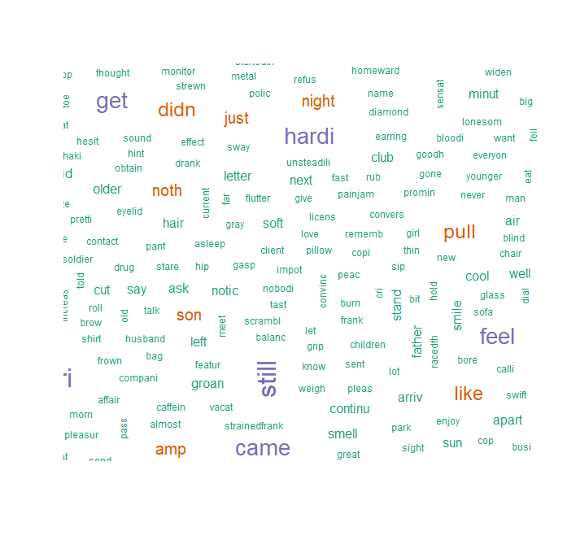

# Text-Analysis-R
Text analysis, also known as text mining, is the process of automatically classifying and extracting meaningful information from unstructured text. It involves detecting and interpreting trends and patterns to obtain relevant insights from data in just seconds.

# Packages Used
<strong> SnowBallC </strong> 
<strong> TM </strong> 
<strong> WordCloud </strong>

# SnowBallC Package
The Snowball compiler translates a Snowball script (a .sbl file) into either athreadsafe ANSI C program or a Java program. For ANSI C, each Snowball script produces a program file and corresponding header file (with .c and .h extensions).The Snowball compiler checks the consistency of its script, and this check was used to discover a typo in a seminal academic paper by Lovins which had remained undetected for 30 years. The basic datatypes handled by Snowball are strings of characters, signed integers, and boolean truth values, or more simply strings, integers and booleans. Snowball's characters are either 8-bit wide, or 16-bit, depending on the mode of use. In particular, both ASCII and 16-bit Unicode are supported. Like the SNOBOL programming language, the flow of control in Snowball is arranged by the implicit use of signals (each statement returns a true or false value), rather than the explicit use of constructs such as if, then, and break found in C and many other programming languages.

# TM Package
The tm package is a text-mining framework which provides some powerful functions which will aid in text-processing steps. It has methods for importing data, handling corpus, metadata management, creation of term document matrices, and preprocessing methods. For managing documents using the tm package, we create a corpus which is a collection of text documents.

# WordCloud Package
Word Cloud is a data visualization technique used for representing text data in which the size of each word indicates its frequency or importance. Significant textual data points can be highlighted using a word cloud. Word clouds are widely used for analyzing data from social network websites.

# Summary
In this we learned to classify text analysis individuals using various factors. We have used Text mining package, TDM (Term Document Matrix), and wordcloud package to classify frequent word count in the given document using R programming.

# Output
Least Frequent words 

Most Frequent words 

WordCloud - Data Visualization 

